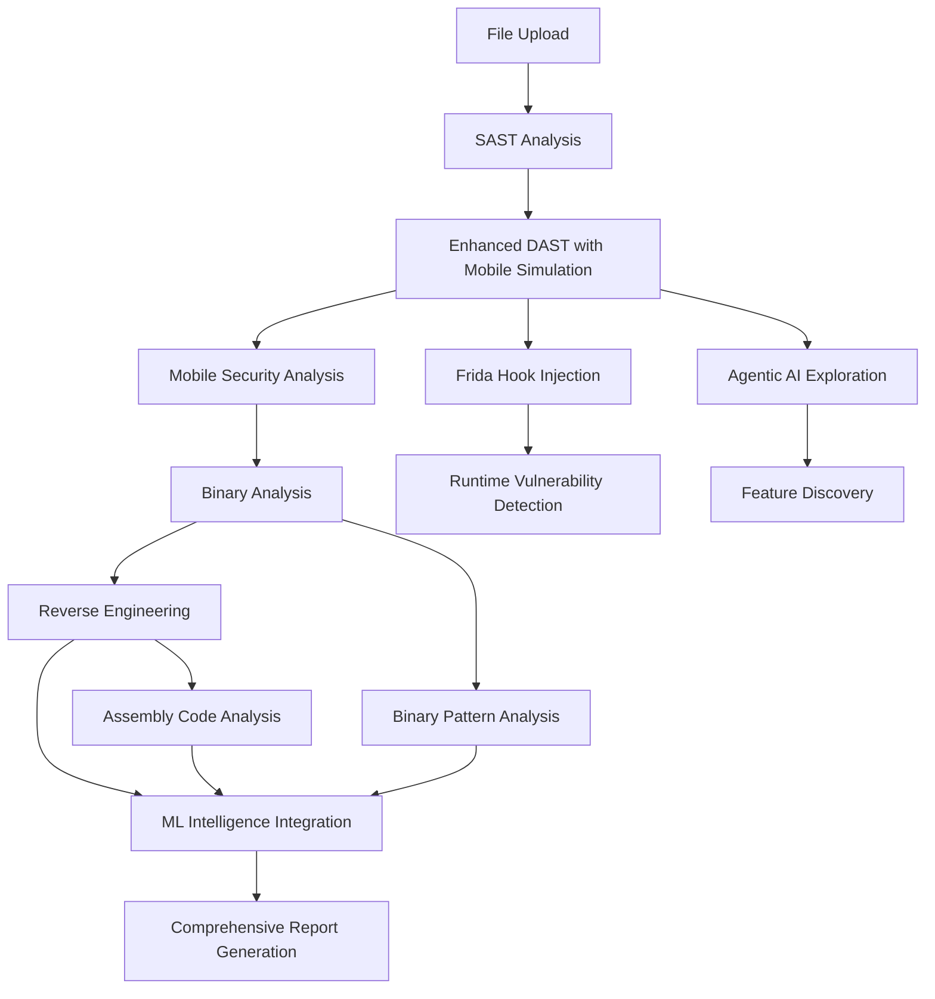

# QuantumSentinel-Nexus: Enhanced DAST & Security Analysis Features

## 🚀 Overview

The QuantumSentinel-Nexus platform has been significantly enhanced with advanced Dynamic Application Security Testing (DAST), mobile application simulation, runtime analysis, and AI-powered vulnerability detection capabilities.

## ✨ Enhanced Features

### 1. Advanced DAST Module with Mobile Simulation

**Enhanced Capabilities:**
- **Mobile Simulator Environment**: Automated setup and configuration of mobile simulation environment
- **Application Installation**: Automated installation of APK/IPA files in simulators
- **Runtime Instrumentation**: Advanced instrumentation for real-time security monitoring
- **Network Traffic Analysis**: Comprehensive monitoring and analysis of all network communications
- **User Behavior Simulation**: AI-driven simulation of user interactions and workflows

**Enhanced DAST Workflow:**
```
1. 🌐 Initialize enhanced DAST engine
2. 📱 Set up mobile simulator environment
3. ⚡ Install application in simulator
4. 🚀 Launch application with instrumentation
5. 🔥 Inject Frida runtime hooks
6. 🤖 Activate agentic AI exploration
7. 📝 Create account and user profiles
8. 🔍 Explore all application features
9. 📊 Monitor network traffic analysis
10. 🔒 Test authentication mechanisms
11. 💾 Analyze data storage patterns
12. 🚨 Runtime vulnerability detection
13. 📋 Generate comprehensive DAST report
```

### 2. Frida Runtime Security Engine

**File:** `security_engines/frida_runtime_engine.py`

**Capabilities:**
- **Real-time Hook Injection**: Comprehensive Frida script injection for runtime analysis
- **Cryptography Monitoring**: Detection of weak encryption algorithms and insecure implementations
- **Network Traffic Interception**: Monitor all HTTP/HTTPS requests and responses
- **Data Storage Analysis**: Track sensitive data storage in SharedPreferences, SQLite, files
- **Authentication Flow Analysis**: Monitor login, biometric, and session management
- **Permission Usage Tracking**: Real-time permission request and usage monitoring
- **API Call Monitoring**: Track sensitive API calls (location, contacts, device ID)
- **Root Detection Bypass**: Advanced bypass techniques for root detection mechanisms
- **Anti-Debugging Bypass**: Comprehensive anti-debugging technique detection and bypass

**Sample Frida Hook (Crypto Monitoring):**
```javascript
Java.perform(function() {
    var Cipher = Java.use("javax.crypto.Cipher");
    Cipher.getInstance.overload('java.lang.String').implementation = function(transformation) {
        console.log("🔒 [CRYPTO] Cipher.getInstance called with: " + transformation);
        send({
            type: "crypto_operation",
            transformation: transformation,
            risk: transformation.includes("ECB") ? "HIGH" : "LOW"
        });
        return this.getInstance(transformation);
    };
});
```

### 3. Agentic AI Exploration Engine

**File:** `security_engines/agentic_exploration_engine.py`

**Features:**
- **Autonomous Application Exploration**: AI-driven discovery of application features and flows
- **User Scenario Generation**: Automatic creation of comprehensive user testing scenarios
- **Security Test Case Generation**: AI-powered generation of security-focused test cases
- **Feature Discovery**: Deep exploration of hidden and debug features
- **Vulnerability Pattern Recognition**: Pattern-based vulnerability identification
- **Risk Assessment**: Automated security scoring and risk classification

**Generated User Scenarios:**
1. **Normal User Registration** (Low Risk)
2. **Malicious Input Testing** (High Risk)
3. **Privilege Escalation Attempt** (Critical Risk)
4. **Data Exfiltration Simulation** (High Risk)

### 4. ML Intelligence Engine Integration

**File:** `security_engines/ml_intelligence_engine.py`

**Advanced Capabilities:**
- **Cross-Module Correlation**: Integration of binary analysis and reverse engineering results
- **Zero-Day Prediction**: ML-powered prediction of potential zero-day vulnerabilities
- **Threat Classification**: Advanced threat family and attack vector identification
- **Behavioral Anomaly Detection**: Pattern recognition for unusual application behavior
- **CVE Correlation**: Automatic cross-referencing with known vulnerability databases
- **Risk Assessment**: AI-powered comprehensive risk scoring and timeline prediction

**ML Models Used:**
- Vulnerability Pattern Classifier
- Zero-Day Predictor
- Binary Similarity Analyzer
- Control Flow Graph Analyzer
- Assembly Code Pattern Detector
- CVE Correlation Engine
- Threat Intelligence Aggregator
- Behavioral Anomaly Detector

### 5. Enhanced Binary Analysis Integration

**New Capabilities:**
- **Entropy Analysis**: Advanced packer and encryption detection
- **API Pattern Recognition**: Suspicious API usage pattern identification
- **Control Flow Analysis**: Complex code structure and obfuscation detection
- **Vulnerability Correlation**: Cross-reference with reverse engineering findings
- **ML-Powered Classification**: AI-driven malware family and threat classification

## 🔬 Analysis Workflow Integration

### Enhanced Module Execution Flow:



## 📊 Vulnerability Detection Capabilities

### DAST Module Detections:
- **Authentication Vulnerabilities**: Session management, biometric bypass, login flaws
- **Network Security Issues**: HTTP usage, certificate validation, traffic interception
- **Data Storage Vulnerabilities**: Plain text storage, insecure encryption
- **Permission Abuse**: Excessive permissions, privilege escalation
- **Runtime Injection**: Code injection, process manipulation
- **Anti-Analysis Bypass**: Root detection, debugging protection circumvention

### ML Intelligence Detections:
- **Process Injection Patterns**: Advanced injection technique identification
- **Control Flow Obfuscation**: Code complexity and evasion technique detection
- **Memory Corruption Risks**: Buffer overflow and use-after-free patterns
- **Anti-Analysis Techniques**: Comprehensive evasion mechanism detection
- **Zero-Day Indicators**: Novel exploitation technique prediction
- **Malware Family Classification**: APT, dropper, backdoor identification

## 🛡️ Security Test Cases

### Automatically Generated Test Cases:
1. **SQL Injection Testing** (Authentication Forms)
2. **File Upload Bypass** (Malicious File Detection)
3. **Intent Hijacking** (Deep Link Security)
4. **Debug Interface Exposure** (Production Security)
5. **Permission Escalation** (Access Control)
6. **Network Security** (HTTPS Enforcement)

## 📈 Reporting and Analytics

### Comprehensive Reports Include:
- **Real-time Progress Tracking**: Live module execution status
- **Vulnerability Aggregation**: Cross-module vulnerability correlation
- **Risk Scoring**: AI-powered security score calculation
- **Timeline Prediction**: Attack timeline and likelihood assessment
- **Remediation Recommendations**: AI-generated security improvement suggestions
- **Threat Intelligence**: IOC generation and threat family identification

### Sample Risk Assessment Output:
```
📊 Overall Security Score: 6.42/10
⚠️ Threat Level: HIGH_RISK
🎯 Attack Timeline: SHORT_TERM (1-7 days)
🛡️ Defense Effectiveness: PARTIALLY_EFFECTIVE
```

## 🚀 Usage Examples

### 1. Enhanced DAST Analysis
```bash
# Upload file for comprehensive analysis
curl -X POST -F "file=@mobile_app.apk" http://localhost:8100/api/upload

# Monitor analysis progress
curl http://localhost:8100/api/analysis/{analysis_id}
```

### 2. Standalone Frida Analysis
```bash
python3 security_engines/frida_runtime_engine.py
```

### 3. Agentic Exploration
```bash
python3 security_engines/agentic_exploration_engine.py
```

### 4. ML Intelligence Analysis
```bash
python3 security_engines/ml_intelligence_engine.py
```

## 🔧 Technical Requirements

### Dependencies:
- **Frida Tools**: `pip3 install frida-tools`
- **Python 3.9+**: For all security engines
- **Mobile Simulators**: Android emulator/iOS simulator for mobile testing
- **Network Analysis Tools**: Built-in traffic monitoring capabilities

### System Requirements:
- **Memory**: 8GB+ RAM for ML model loading
- **Storage**: 10GB+ for analysis results and temporary files
- **Network**: Internet connectivity for CVE database correlation
- **Platform**: macOS, Linux, Windows (with appropriate simulator support)

## 🎯 Future Enhancements

### Planned Features:
1. **Real Device Testing**: Integration with physical device farms
2. **Advanced ML Models**: Custom-trained vulnerability detection models
3. **Threat Hunting**: Automated threat hunting capabilities
4. **API Security Testing**: Comprehensive API vulnerability assessment
5. **Container Security**: Docker/Kubernetes security analysis
6. **IoT Device Testing**: Internet of Things security assessment

## 📚 Documentation

- **API Documentation**: Available at `/api/docs` endpoint
- **Module Integration Guide**: See `docs/module-integration.md`
- **Custom Hook Development**: See `docs/frida-hooks.md`
- **ML Model Training**: See `docs/ml-training.md`

---

**QuantumSentinel-Nexus** - Advanced AI-Powered Security Testing Platform
*Empowering security researchers with cutting-edge vulnerability detection capabilities*