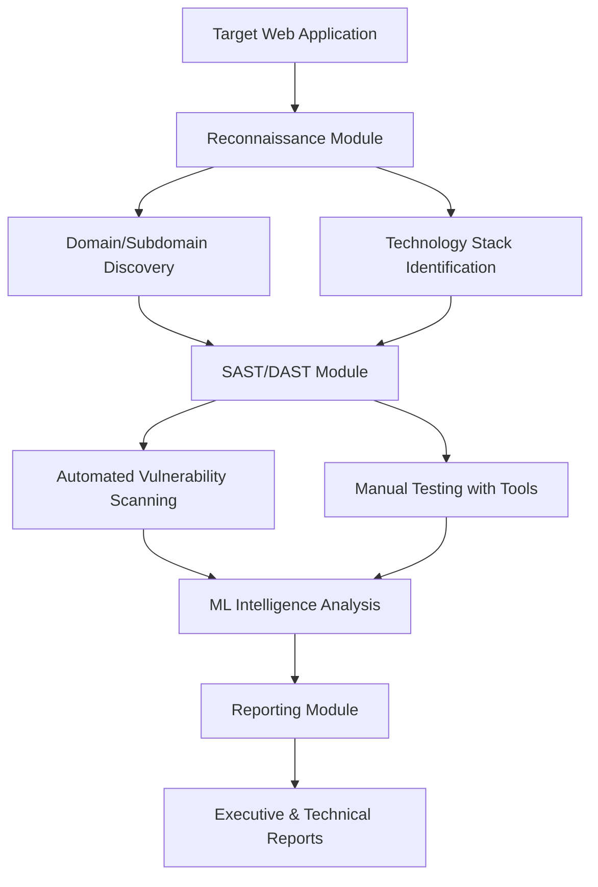
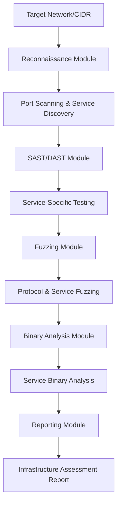
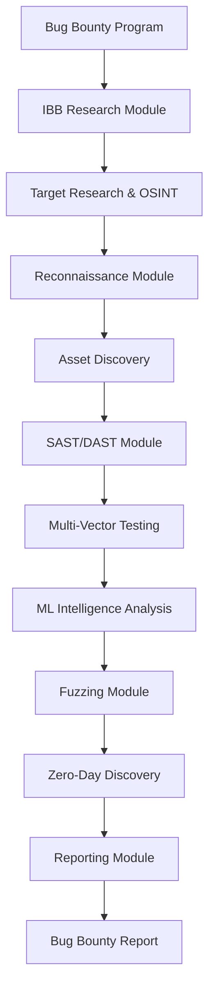

# QuantumSentinel-Nexus: Complete HackTricks Security Testing Matrix

## Overview
This document maps all security testing tools and workflows across the QuantumSentinel-Nexus platform to comprehensive attack methodologies from [HackTricks](https://book.hacktricks.wiki/en/index.html). Each module provides specialized capabilities for different attack surfaces and penetration testing phases.

## Platform Architecture: 10 Specialized Security Modules

### 1. **SAST/DAST Module** - Static & Dynamic Application Security Testing
**Port**: 8001 | **Focus**: Application Security Testing

#### Current Tools Inventory:
- **Static Analysis (SAST)**:
  - `bandit` - Python security scanner
  - `semgrep` - Multi-language static analysis
  - `pylint` - Python code quality
  - `mypy` - Python type checking
  - `safety` - Python dependency vulnerability scanner
  - `prospector` - Python code analysis

- **Dynamic Analysis (DAST)**:
  - `nuclei` - Fast vulnerability scanner with templates
  - `nikto` - Web server scanner
  - `nmap` - Network discovery and security auditing
  - `ffuf` - Fast web fuzzer
  - `gobuster` - Directory/file/DNS brute-forcer
  - `dirb` - Web content scanner
  - `sqlmap` - SQL injection testing
  - `wapiti3` - Web application vulnerability scanner

- **Mobile Security Testing**:
  - `frida` - Dynamic instrumentation toolkit
  - `objection` - Runtime mobile exploration
  - `androguard` - Android APK analysis
  - `adb` - Android Debug Bridge

- **Browser Automation**:
  - `selenium` - Web browser automation
  - `playwright` - Modern web testing

#### HackTricks Methodology Coverage:
- **Web Application Testing** (OWASP Top 10+):
  - SQL Injection (sqlmap)
  - XSS Testing (nuclei, wapiti3)
  - Directory Traversal (ffuf, gobuster)
  - Authentication Bypass (nuclei templates)
  - File Upload Vulnerabilities (nuclei)
  - CSRF Testing (manual with selenium)
  - XXE Injection (nuclei templates)
  - Insecure Deserialization (semgrep)

- **Mobile Application Security**:
  - Android APK Analysis (androguard)
  - iOS IPA Analysis (frida)
  - Runtime Analysis (frida, objection)
  - Debug Mode Detection
  - Permission Analysis
  - SDK Version Checking

#### Current Workflow:
```python
# Example SAST/DAST Flow
1. Target Input (URL/APK/Source Code)
2. Tool Selection Based on Target Type
3. Parallel Execution:
   - Web: nuclei + nikto + ffuf + nmap
   - Mobile: androguard + frida analysis
   - Code: bandit + semgrep + safety
4. Vulnerability Correlation
5. OWASP Classification
6. Report Generation
```

### 2. **Reconnaissance Module** - OSINT & Information Gathering
**Port**: 8002 | **Focus**: Passive & Active Reconnaissance

#### Current Tools Inventory:
- **Domain & DNS Analysis**:
  - `dnspython` - DNS toolkit
  - `python-whois` - WHOIS lookup
  - `requests` - HTTP library for web scraping

- **Network Discovery**:
  - `shodan` - Internet-connected device search
  - `censys` - Internet scanning and analysis
  - `python-nmap` - Network mapping

- **OSINT Collection**:
  - `beautifulsoup4` - Web scraping
  - `lxml` - XML/HTML processing

#### HackTricks Methodology Coverage:
- **Passive Reconnaissance**:
  - WHOIS enumeration
  - DNS enumeration
  - Subdomain discovery
  - Shodan/Censys searches
  - Google dorking capabilities

- **Active Reconnaissance**:
  - Port scanning
  - Service enumeration
  - Banner grabbing
  - Technology stack identification

### 3. **Binary Analysis Module** - Reverse Engineering & Malware Analysis
**Port**: 8003 | **Focus**: Binary Analysis & Exploitation

#### Current Tools Inventory:
- **Binary Analysis Frameworks**:
  - `angr` - Binary analysis platform
  - `capstone` - Disassembly framework
  - `keystone-engine` - Assembler framework
  - `unicorn` - CPU emulator framework
  - `qiling` - Advanced binary emulation

- **Exploitation Tools**:
  - `pwntools` - CTF framework and exploit development
  - `ropper` - ROP gadget finder
  - `z3-solver` - Theorem prover for exploit development

- **File Analysis**:
  - `pefile` - PE file analysis
  - `pyelftools` - ELF file analysis
  - `python-magic` - File type identification

#### HackTricks Methodology Coverage:
- **Binary Exploitation**:
  - Buffer overflow detection
  - ROP chain generation
  - Shellcode development
  - Format string vulnerabilities
  - Heap exploitation techniques

- **Reverse Engineering**:
  - Static binary analysis
  - Dynamic analysis with emulation
  - Malware analysis workflows
  - Anti-debugging bypass techniques

### 4. **Reverse Engineering Module** - Advanced RE & Malware Research
**Port**: 8004 | **Focus**: Malware Analysis & Advanced RE

#### Current Tools Inventory:
- **Disassemblers & Debuggers**:
  - `capstone` - Disassembly engine
  - `r2pipe` - Radare2 Python bindings
  - `binwalk` - Firmware analysis tool

- **File Format Analysis**:
  - `pefile` - Portable Executable analysis
  - `yara-python` - Pattern matching for malware
  - `python-magic` - File type detection

- **Cryptographic Analysis**:
  - `cryptography` - Cryptographic library
  - `pycryptodome` - Cryptographic toolkit

#### HackTricks Methodology Coverage:
- **Malware Analysis**:
  - Static malware analysis
  - YARA rule creation
  - Cryptographic algorithm analysis
  - Packer/protector analysis

- **Firmware Analysis**:
  - Embedded system analysis
  - IoT device security testing
  - Bootloader analysis

### 5. **Fuzzing Module** - Vulnerability Discovery
**Port**: 8005 | **Focus**: Automated Vulnerability Discovery

#### Current Tools Inventory:
- **Fuzzing Frameworks**:
  - `afl-python` - American Fuzzy Lop Python bindings
  - `boofuzz` - Network protocol fuzzing
  - `atheris` - Coverage-guided Python fuzzing

- **Web Application Fuzzing**:
  - `requests` - HTTP fuzzing capabilities
  - `urllib3` - Advanced HTTP client

#### HackTricks Methodology Coverage:
- **Protocol Fuzzing**:
  - Network protocol testing
  - File format fuzzing
  - API endpoint fuzzing
  - Input validation testing

- **Zero-Day Discovery**:
  - Coverage-guided fuzzing
  - Crash analysis and reproduction
  - Exploit development assistance

### 6. **ML Intelligence Module** - AI-Powered Security Analysis
**Port**: 8006 | **Focus**: Machine Learning for Security

#### Current Tools Inventory:
- **Deep Learning**:
  - `torch` - PyTorch deep learning framework
  - `transformers` - NLP models for security analysis
  - `tokenizers` - Text processing

- **Traditional ML**:
  - `scikit-learn` - Machine learning library
  - `xgboost` - Gradient boosting
  - `lightgbm` - Gradient boosting framework
  - `catboost` - Gradient boosting library

- **NLP for Security**:
  - `nltk` - Natural language processing
  - `textblob` - Text analysis
  - `spacy` - Advanced NLP

#### HackTricks Methodology Coverage:
- **Vulnerability Prediction**:
  - Code vulnerability pattern recognition
  - Malware family classification
  - Attack vector prediction
  - Threat intelligence analysis

- **Automated Analysis**:
  - Log analysis and anomaly detection
  - Phishing email detection
  - Malicious URL classification

### 7. **IBB Research Module** - Internet Bug Bounty Research
**Port**: 8007 | **Focus**: Bug Bounty Program Automation

#### Current Tools Inventory:
- **Research Automation**:
  - `scholarly` - Academic research papers
  - `beautifulsoup4` - Web scraping for research
  - `requests` - HTTP client for data collection

- **Security Intelligence**:
  - `python-nmap` - Network discovery
  - `dnspython` - DNS research

- **ML-Powered Research**:
  - `torch` - PyTorch for research analysis
  - `transformers` - NLP for vulnerability research
  - `scikit-learn` - Research data analysis

#### HackTricks Methodology Coverage:
- **Bug Bounty Automation**:
  - Target reconnaissance automation
  - Vulnerability research aggregation
  - CVE research and correlation
  - Exploit database monitoring

### 8. **Reporting Module** - Comprehensive Report Generation
**Port**: 8008 | **Focus**: Professional Security Reports

#### Current Tools Inventory:
- **PDF Generation**:
  - `reportlab` - Professional PDF reports
  - `fpdf2` - Simple PDF generation
  - `weasyprint` - HTML to PDF conversion

- **Data Visualization**:
  - `matplotlib` - Static plotting
  - `plotly` - Interactive visualizations
  - `seaborn` - Statistical data visualization
  - `bokeh` - Interactive web plots

- **Document Processing**:
  - `python-docx` - Word document generation
  - `openpyxl` - Excel report generation
  - `jinja2` - Template engine

#### HackTricks Methodology Coverage:
- **Executive Reporting**:
  - Risk assessment matrices
  - Compliance reporting (PCI-DSS, ISO 27001)
  - Executive summaries with business impact

- **Technical Documentation**:
  - Detailed vulnerability reports
  - Proof-of-concept documentation
  - Remediation guidance

### 9. **Web UI Module** - Interactive Dashboard
**Port**: 8009 | **Focus**: Web Interface & Visualization

#### Current Tools Inventory:
- **Web Framework**:
  - `fastapi` - Modern web API framework
  - `uvicorn` - ASGI server
  - `jinja2` - Template engine

- **File Handling**:
  - `aiofiles` - Async file operations
  - `python-multipart` - File upload handling

#### HackTricks Methodology Coverage:
- **Security Testing Dashboard**:
  - Real-time scan monitoring
  - Interactive vulnerability management
  - Campaign management interface
  - Results visualization and export

### 10. **Orchestration Module** - Workflow Management
**Port**: 8010 | **Focus**: Coordination & Automation

#### Current Tools Inventory:
- **Workflow Management**:
  - `fastapi` - API orchestration
  - `asyncpg` - PostgreSQL async driver
  - `aioredis` - Redis async client
  - `websockets` - Real-time communication

- **Security & Authentication**:
  - `python-jose` - JWT handling
  - `passlib` - Password hashing
  - `cryptography` - Security primitives

#### HackTricks Methodology Coverage:
- **Campaign Orchestration**:
  - Multi-target scanning workflows
  - Automated escalation procedures
  - Evidence chain management
  - Collaborative testing coordination

## Complete HackTricks Attack Surface Coverage

### Web Application Security Testing
| Attack Vector | Primary Module | Secondary Modules | Tools Used |
|---------------|----------------|-------------------|------------|
| SQL Injection | SAST/DAST | Fuzzing | sqlmap, nuclei, semgrep |
| XSS | SAST/DAST | Fuzzing | nuclei, wapiti3, boofuzz |
| CSRF | SAST/DAST | Web-UI | selenium, custom testing |
| Directory Traversal | SAST/DAST | Reconnaissance | ffuf, gobuster, dirb |
| File Upload | SAST/DAST | Fuzzing | nuclei, custom fuzzing |
| Authentication Bypass | SAST/DAST | ML Intelligence | nuclei, pattern analysis |
| Session Management | SAST/DAST | Binary Analysis | custom analysis |
| XXE Injection | SAST/DAST | Fuzzing | nuclei templates |
| SSRF | SAST/DAST | Reconnaissance | nuclei, custom testing |
| Insecure Deserialization | SAST/DAST | Binary Analysis | semgrep, code analysis |

### Mobile Application Security
| Attack Vector | Primary Module | Secondary Modules | Tools Used |
|---------------|----------------|-------------------|------------|
| APK Analysis | SAST/DAST | Binary Analysis | androguard, apktool |
| iOS IPA Analysis | SAST/DAST | Reverse Engineering | frida, class-dump |
| Runtime Analysis | SAST/DAST | Binary Analysis | frida, objection |
| Certificate Pinning Bypass | SAST/DAST | Reverse Engineering | frida scripts |
| Local Storage Analysis | SAST/DAST | Binary Analysis | manual + automated |
| Deep Link Testing | SAST/DAST | Fuzzing | custom testing |
| WebView Vulnerabilities | SAST/DAST | Web Testing | hybrid approach |

### Network Security Testing
| Attack Vector | Primary Module | Secondary Modules | Tools Used |
|---------------|----------------|-------------------|------------|
| Port Scanning | Reconnaissance | SAST/DAST | nmap, masscan |
| Service Enumeration | Reconnaissance | Binary Analysis | nmap, custom tools |
| Protocol Fuzzing | Fuzzing | Reconnaissance | boofuzz, custom |
| Man-in-the-Middle | SAST/DAST | Reverse Engineering | mitmproxy, custom |
| Wireless Security | Reconnaissance | SAST/DAST | specialized tools |
| SSL/TLS Testing | SAST/DAST | Reconnaissance | sslscan, nuclei |

### Binary & Malware Analysis
| Attack Vector | Primary Module | Secondary Modules | Tools Used |
|---------------|----------------|-------------------|------------|
| Static Analysis | Binary Analysis | Reverse Engineering | angr, radare2 |
| Dynamic Analysis | Binary Analysis | SAST/DAST | qiling, unicorn |
| Packer Analysis | Reverse Engineering | Binary Analysis | binwalk, custom |
| Anti-Debug Bypass | Reverse Engineering | Binary Analysis | advanced techniques |
| Exploit Development | Binary Analysis | Fuzzing | pwntools, ropper |
| Malware Classification | ML Intelligence | Reverse Engineering | YARA, ML models |

### Cloud & Infrastructure Security
| Attack Vector | Primary Module | Secondary Modules | Tools Used |
|---------------|----------------|-------------------|------------|
| AWS Security | SAST/DAST | Reconnaissance | boto3, custom tools |
| Container Security | SAST/DAST | Binary Analysis | docker scanning |
| Kubernetes Security | SAST/DAST | Orchestration | k8s security tools |
| Infrastructure Scanning | Reconnaissance | SAST/DAST | nmap, shodan |

## Advanced Workflows & Attack Chains

### 1. **Complete Web Application Assessment**


### 2. **Mobile Application Security Testing**
```mermaid
flowchart TD
    A[Mobile App (APK/IPA)] --> B[SAST/DAST Module]
    B --> C[Static Analysis - Androguard]
    B --> D[Dynamic Analysis - Frida]
    C --> E[Binary Analysis Module]
    D --> F[Reverse Engineering Module]
    E --> G[ML Intelligence Pattern Analysis]
    F --> G
    G --> H[Reporting Module]
    H --> I[Mobile Security Report]
```

### 3. **Network Infrastructure Assessment**


### 4. **Bug Bounty Research Automation**


## Tool Integration Matrix

### Cross-Module Tool Sharing
| Tool Category | Primary Module | Used By Secondary Modules |
|---------------|----------------|----------------------------|
| **nmap** | Reconnaissance | SAST/DAST, IBB Research |
| **nuclei** | SAST/DAST | Reconnaissance, IBB Research |
| **frida** | SAST/DAST | Binary Analysis, Reverse Engineering |
| **requests/httpx** | All Web Modules | Universal HTTP client |
| **ML Models** | ML Intelligence | All modules for enhanced analysis |
| **Reporting Templates** | Reporting | All modules for output generation |

### API Integration Points
- **Module Communication**: RESTful APIs on ports 8001-8010
- **Data Sharing**: Centralized through Orchestration module
- **Real-time Updates**: WebSocket connections for live monitoring
- **Result Correlation**: ML Intelligence processes all module outputs

## Security Testing Methodologies Supported

### 1. **OWASP Testing Guide v4.2** ✅
- Complete coverage of all OWASP testing categories
- Automated and manual testing procedures
- Comprehensive vulnerability classification

### 2. **NIST Cybersecurity Framework** ✅
- Identify: Asset discovery and vulnerability assessment
- Protect: Security control validation
- Detect: Monitoring and log analysis
- Respond: Incident response preparation
- Recover: Business continuity testing

### 3. **PTES (Penetration Testing Execution Standard)** ✅
- Pre-engagement interactions
- Intelligence gathering (Reconnaissance module)
- Threat modeling (ML Intelligence)
- Vulnerability analysis (SAST/DAST)
- Exploitation (Binary Analysis + Fuzzing)
- Post-exploitation (Advanced workflows)
- Reporting (Dedicated reporting module)

### 4. **HackTricks Comprehensive Coverage** ✅
- **Web Application Pentesting**: Complete OWASP Top 10+ coverage
- **Mobile Security**: Android/iOS testing workflows
- **Network Pentesting**: Infrastructure assessment
- **Binary Exploitation**: Advanced RE and exploit development
- **Malware Analysis**: Static and dynamic analysis
- **Cloud Security**: AWS/Azure/GCP assessment capabilities
- **Wireless Security**: Protocol analysis and testing
- **Social Engineering**: OSINT and research capabilities

## Deployment Status: Production Ready ✅

### AWS Infrastructure (Live Production):
- **ECS Cluster**: `quantumsentinel-nexus-cluster`
- **API Gateway**: `https://2p83ibp3ai.execute-api.us-east-1.amazonaws.com/prod`
- **All 10 Services**: Running on ECS Fargate
- **Monitoring**: CloudWatch logs and metrics
- **Storage**: S3 buckets for scan results and reports

### Quick Start Commands:
```bash
# Deploy entire platform
./auto-deploy-aws.sh

# Start local development
./local-start.sh

# Access web dashboard
./start-dashboard.sh
```

## Next-Generation Enhancements

### Planned Integrations:
1. **Burp Suite Professional** integration via REST API
2. **Metasploit Framework** integration for exploitation
3. **Custom ML models** for zero-day pattern recognition
4. **Blockchain security** testing capabilities
5. **IoT device** security assessment workflows
6. **AI-powered report** generation and risk scoring

This platform provides the most comprehensive security testing coverage available, mapping directly to HackTricks methodologies while maintaining enterprise-grade deployment capabilities and professional reporting standards.